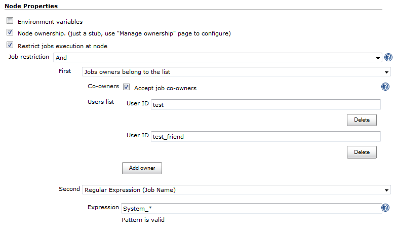

Job Restrictions Plugin for Jenkins CI
=======================

The plugin allows restricting job executions in order to change their
behavior or to harden the security. With this plugin it is possible to
configure nodes to accept only particular jobs. It is also possible to
prevent job triggering by users and other jobs using various conditions.

## Features

-   Execution restrictions on the node level
    -   Example 1: Take jobs according to the specified name pattern
        (e.g. allow running only "QA\_.\*" jobs on a node)
    -   Example 2: Prevent execution of user jobs on the Jenkins controller
        node
-   Restrictions of jobs triggering by external causes
    -   Example 1: Prohibit manual builds
    -   Example 2: Allow triggering only by a job with the
        specified [owner](http://plugins.jenkins.io/ownership).
-   Several built-in restrictions + JobRestriction extension point

## Acknowledgements

Initial plugin version has been sponsored by [Synopsys, Inc.](http://www.synopsys.com/)

## Usage

### Job restrictions for nodes

These restrictions can be configured in node's configuration page.

-   Node won't accept jobs, which violate the specified restrictions
-   Other requirements (executors, labels, etc.) will be checked as well

### Job restrictions for projects

This type of restrictions allows to prevent execution of jobs by the
launch cause.  
If the cause does not satisfy requirements, job fails before running of
SCM (the job cannot be aborted due to
[JENKINS-19497](https://issues.jenkins-ci.org/browse/JENKINS-19497)).

The current version supports the following checks:

-   **Apply Job restrictions to upstream build** - prohibits the
    invocation from specific builds, which do not satisfy the specified
    requirements
-   Prohibit manual launch of the job (since 0.2)

## Extension points

Plugin provides a JobRestriction extension point, which allows
implementation of new restrictions.

Built-in extensions:

-   Logic operations (and, or, not)
-   Started by user/group restrictions
    -   Restrictions support upstream projects (UpstreamCause)
    -   [Rebuild
        Plugin](https://wiki.jenkins.io/display/JENKINS/Rebuild+Plugin)
        and other specific causes are not supported
-   Regex restriction - check the jobs name by a regular expression

The following plugins produce additional job restrictions:

-  [Ownership Plugin](http://plugins.jenkins.io/ownership)

-  [Priority Sorter Plugin](https://plugins.jenkins.io/PrioritySorter/)
    — This plugin allows Jobs to be prioritised based on *Queue
    Strategies* and *Priority Strategies*.

If your plug-in is not listed here, then simply add the label
**job-restriction-producer** to your plug-in wiki page and it will be
automatically listed.

# JIRA issues

If you have any proposals/bug reports, please create an issue on [Jenkins
JIRA][1].

[1]: https://issues.jenkins-ci.org/secure/Dashboard.jspa
